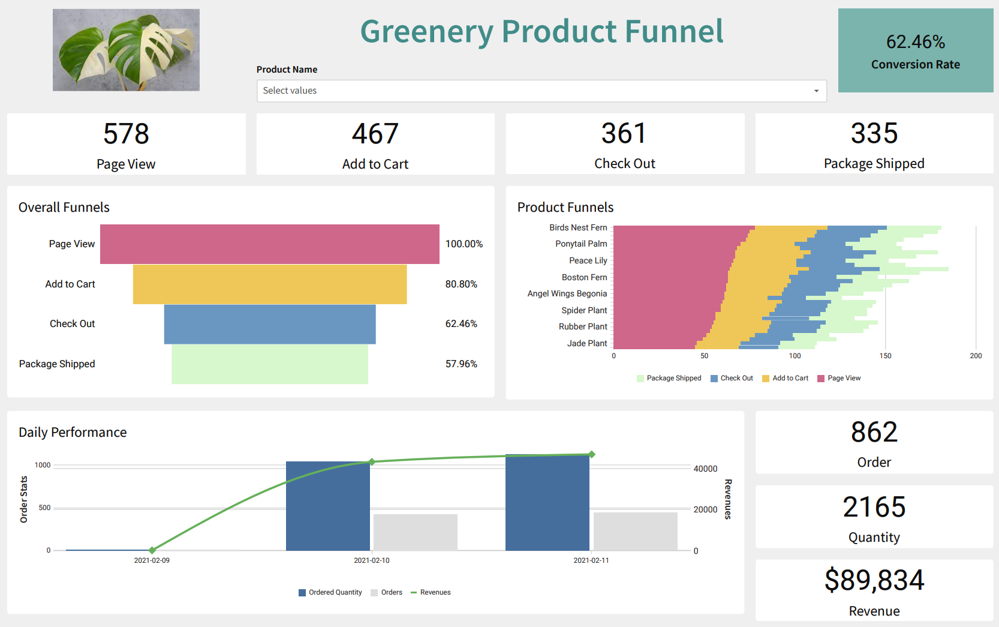

# Project Week 04


## Part 1. dbt Snapshots 

Which orders changed from week 3 to week 4?

There are three orders which changed from week 3 to week 4. 

* 0e9b8ee9-ad0a-42f4-a778-e1dd3e6f6c51
* 841074bf-571a-43a6-963c-ba7cbdb26c85
* df91aa85-bfc7-4c31-93ef-4cee8d00a343 
```sql
select * 
from dev_db.dbt_trangnguyenaudibenede.orders_snapshot
where date(dbt_valid_to) >= '2023-01-29';
```


## Part 2. Modeling challenge

- How are our users moving through the product funnel?

- Which steps in the funnel have largest drop off points?

I created a [dashboard in Sigma](https://app.sigmacomputing.com/corise-dbt/workbook/workbook-7fNfbtqpoF1VXFynYPWTC6) to answer the above questions. 





## Part 3: Reflection questions 

If your organization is using dbt, what are 1-2 things you might do differently / recommend to your organization based on learning from this course?

Based on the learnings from this course, there are several things I think we can apply and/or start doing more in our team:

* Refactor our facts, dimension tables, folders structure, naming convention, .yml files, and so on.
* Explore the power of macros and dbt packages to automate and have cleaner and reusable code (apply DRY principle).
* Implement more tests and alerts in our dbt models so that we can be proactive.
* Leverage dbt for documentation and have better understanding of our data lineage and dependencies.